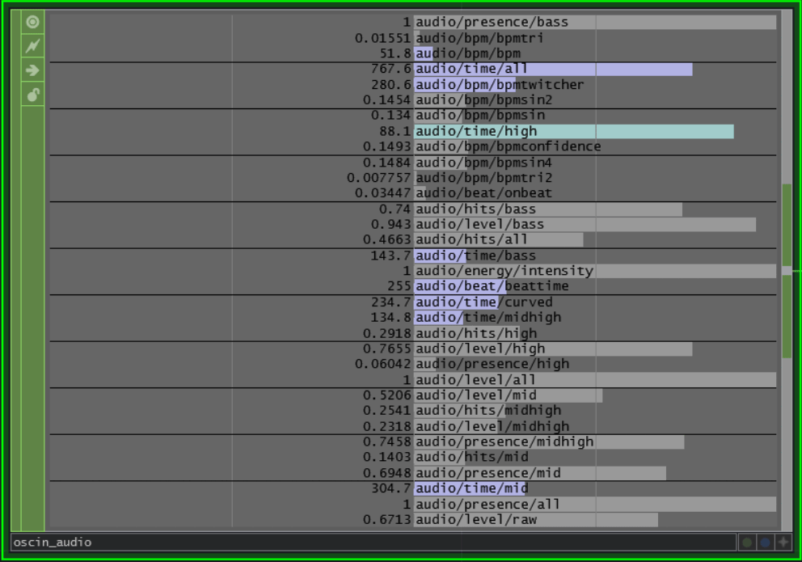
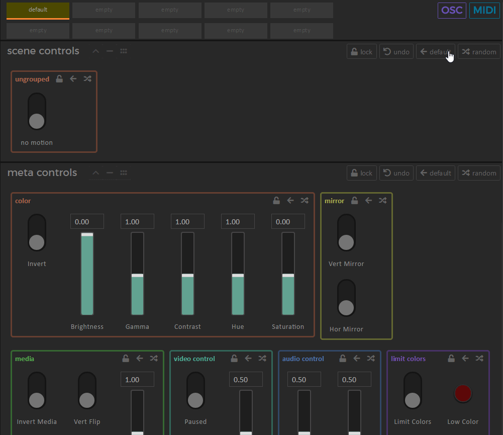

# OSC

> **NOTE**: OSC is only available for users with a Synesthesia Pro license. Check out our [upgrades page](https://production.synesthesia.live/user/license-upgrade) if you'd like to go Pro.

> Synesthesia's OSC API is still in development and subject to change.

## Overview
OSC opens up a powerful channel of communication between Synesthesia and other software. It stands for Open Sound Control, and it's a networking protocol. You can think of it like an alternative to MIDI that is much more powerful and flexible and can be sent over a network ([learn more](https://opensoundcontrol.stanford.edu/)).

You can use OSC to control Synesthesia from other apps on your machine, from a different computer on the same network, or from your phone or tablet. You can build custom interfaces and tools for Synesthesia, expanding its functionality however you like.

It also enables you to harness the Synesthesia Audio Engine in other software, sending out audio analysis data in real-time.

In order to send or receive OSC messages, you'll need to use OSC-compatible software. There are tons of options — here are some great ones:

- [TouchOSC](https://hexler.net/touchosc) (iOS/Android)
- [Lemur](https://liine.net/en/products/lemur/) (iOS/Android)
- [Vezer](https://imimot.com/vezer/) (macOS only)
- [OSC/PILOT](https://oscpilot.com/) (macOS/Windows)
- [TouchDesigner](https://derivative.ca/) (macOS/Windows)
- [Max/MSP](https://cycling74.com/products/max) (macOS/Windows)
- [Processing](https://processing.org/) (macOS/Windows)
- [Chataigne](https://benjamin.kuperberg.fr/chataigne/en) (macOS/Windows)
- [TWO (The Wizard of OSC)](https://controlmedia.art/) (macOS/Windows)

## OSC Output

### Setup

To set up OSC Output, go to the Settings tab and find the "OSC" section. First, turn on "Output" to activate the feature. Then configure your output with the following settings:

- **Output Address**. This is the IP address that Synesthesia will send OSC to.
	- `127.0.0.1` is the special "localhost" address. Use this to send messages to other software running on the same machine.
	- `255.255.255.255` is the special "broadcast" address. When this address is selected, Synesthesia will send to all machines on the local network.
	- To target specific machines on your network, you need to determine the local IP address of that machine. Here's a [tutorial](https://beebom.com/how-find-ip-address-windows-mac/) to find your local IP address on Mac or Windows. It should be your private IPv4 address (likely starting with `192.168`).
- **Output Port**. This is the networking port to send to. This port must match the incoming port selected in the receiving software. You can choose any integer up to `65535`.

### Audio Variables

One of Synesthesia's core features is the Audio Engine, which analyzes music in real-time and outputs a host of data to the scenes (see the [audio uniforms](../ssf/audio_uniforms.md) page for reference). You can output all of this data over OSC, allowing you to easily create audio reactive content in other software. Here's what the output looks like in TouchDesigner:

To enable this feature, simply check the "Output Audio Variables" checkbox, and the data will be sent to your selected output IP and port.

### Controls

#### Use Cases
Synesthesia can output its control values and scene information over OSC, allowing lots of potential use cases:

- support two-way communication with interfaces like TouchOSC, OSC/PILOT, or Lemur, so the interface stays synced with changes made in Synesthesia
- automatically update external interfaces to reflect the controls of a new scene
- automatically generate an interface for Synesthesia based on its OSC namespace using software like The Wizard of OSC or Chataigne
- record a sequence of control values and play it back using OSC recording software like The Wizard of OSC
- use Synesthesia as an OSC controller and control panel for other software
- monitor Synesthesia’s state in other software to create side effects or interactions
    
#### Normalized vs. Raw Values

There are two modes for outputting control values:

- **Output Normalized Values** — send the control's value normalized between `0` and `1`, representing the value of the control as a fraction of its range. This mode does not include motion effects like smoothing or speed. This is perfect for syncing Synesthesia with external controllers like TouchOSC or OSC/PILOT, when you want to keep GUI elements synced with Synesthesia's GUI
- **Output Raw Values** — send the control’s actual scaled values that are passed into the shader. This is great when using Synesthesia as a controller for other software or monitoring its state. In this mode, values will be sent to the control address with `/raw` added at the end.

**NOTE**: In Normalized mode, Synesthesia will send additional raw values for dropdown controls. This is included to support full compatibility with TouchOSC, which expects scaled integer values as input for radio buttons.

#### Control Address Format
Control values are sent out on addresses that can also receive input. There are two options for how to format these addresses, matching the two methods of [updating controls](#updating-controls):

- **Scene-Specific Addresses** — use addresses that are namespaced by the scene title and use the control names, like `/controls/hexarray/separation`. This is useful for creating and syncing scene-specific interfaces, using Synesthesia as a controller for other software, or monitoring the state of a scene.
- **Global Addresses** — use addresses that remain consistent across all scenes and use the type and position of the control, like `/controls/global/slider/1`. This is useful for creating and syncing a unified interface that can control all Synesthesia scenes. **NOTE**: only scene controls have a global address; meta controls will always have the same address regardless of settings, like `/controls/meta/brightness`.

#### Scene Information
When a scene is launched, Synesthesia outputs a host of information about the scene to help setup/update external interfaces. The following information is outputted:

- **Scene name** — the name of the scene is outputted in the format `/scenes/{sceneName}`, matching the OSC input [scenes route](#scenes). You can listen for this message to update your interface when the scene changes
- **Control values** — the values of all controls in the scene are outputted. In `Raw` mode, three messages are sent: the min, max, then default value. Some software (like TWO) can automatically update the range of a control based on the min and max received values, so these messages can immediately configure an interface's ranges. In `Normalized` mode, only the normalized default values are sent (since the range is always `0` to `1`). The format of these output messages is determined by the Control Address Format setting.
- **Global control names** — the names of global controls are outputted, allowing you to update the labels of a generic external interface that uses global addresses. These messages take the form `/controls/global/{type}/{position}/name {controlName}`. If you load the scene `Hex Array`, for example, Synesthesia will output `/controls/global/slider/1/name "separation"`, because that's the name of the first slider in the scene. Synesthesia sends 16 messages per type of control. If there are fewer than 16 of a type in the scene, it sends an *empty string* as the control name for all the extra slots. Since there are only 6 sliders in `Hex Array` the 7th slider message will be `/controls/global/slider/7/name ""` (and so on until `16`). This is set up so you can easily clear the labels for controls in your interface that are not active without scripting.
- **Dropdown control information** — the number of options and labels for dropdown controls are outputted, so you can fully configure an external dropdown GUI. The number of options (`int`) is sent at the control's address + `/numoptions`, then each label is sent at the address + `/label`. For example, if you load the scene `lavalamp` with Scene-Specific Addresses, Synesthesia will send the following 4 messages:
	- `/controls/lavalamp/colorpalette/numoptions 3`
	- `/controls/lavalamp/colorpalette/label "vaporwave"`
	- `/controls/lavalamp/colorpalette/label "amber"`
	- `/controls/lavalamp/colorpalette/label "dreamy"`

## OSC Input

### Setup
To set up OSC Input, go to the Settings tab and find the "OSC" section. There are two settings related to OSC Input:

- **Input**. Turn OSC input on or off.
- **Input Port**. This is the networking port on which Synesthesia will listen for incoming messages. You can choose any integer up to `65535`.

### OSC Tooltip

Click the OSC button next to the MIDI button in the top right of the control panel. This will turn on OSC mapping mode. You can now click any highlighted item and see all the addresses by which you can control it. You can select, copy and paste routes shown on the tooltip.

### Controls
#### Updating Controls
You can update controls using a set of fixed OSC addresses — no need to set up any mappings.

Use this route to update controls:

- `/controls/{bank}/{name} {value}`
	- `bank` (string) — the control bank that the control is in: `"scene"`, `"meta"`, or the name of a specific scene (which should be lowercase)
	- `name` (string) — the name of the control. It should be all lowercase without any underscores or hyphens.
	- `value` (float) — the value to set the control to. You can pass up to three numbers depending on the dimension of the control. By default these numbers should be normalized between 0 and 1, and Synesthesia will scale that value to the range of the control (see the `/raw` option below to change this behavior)

**Options**:

- you can target specific dimensions of a multidimensional control by adding the component to the address. Use `/x` or `/y` for xy controls and `/r`, `/g`, or `/b` for color controls
- add `/raw` to the address to treat the value argument as raw (scaled to the range of the control instead of normalized between 0 and 1)
- add `/default` to set control to default
- add `/random` to randomize the control
- add `/preset` to set the control to its value in the current preset
- add `/lock` to treat the value argument as the control's lock state

**Examples**:

- `/controls/meta/brightness 0.` — set the `brightness` meta control to `0`
- `/controls/hexarray/separation 1.0` — set up a mapping that only applies to the scene "Hex Array"
- `/controls/scene/xy1 0.5 0.5` — set the scene control called `xy1` to center position
- `/controls/scene/xy1/raw -1.0 2.5` — use the `/raw` option to set the xy using specific, scaled values
- `/controls/meta/high_color 0.0 1.0 1.0` — set `high_color` to cyan
- `/controls/meta/high_color/g 1.0` — set the green channel of `high_color` to `1`
- `/controls/scene/xy1/random` — randomize the `xy1` control
- `/controls/scene/xy1/default` — set the `xy1` control back to default
- `/controls/meta/hue/lock 1.0` — lock the hue meta control

#### Global Controls
Selecting controls by their name can be a bit limiting. If you wanted to build an OSC controller for Synesthesia, you'd need to create a separate interface for each scene with its specific controls. 

To get around this, a control can be updated using a *global* address. You can use the same set of addresses to update scene controls for any scene, based on the type and order of control: the first slider, the second bang, the third toggle etc. If you've used MIDI to control Synesthesia, you're probably familiar with this idea of global mappings. 

**NOTE**: only scene controls have a global address; meta controls have one fixed address, like `/controls/meta/brightness`.

You can update controls globally with this route:

- `/controls/global/{type}/{position}`
	- `type` (string) — the type of control: `slider`, `knob`, `toggle`, `bang`, `xy`, `color`, or `dropdown`
	- `position` (int) — the position of the control within the scene controls, starting at `1`

**Options**:

All of the options listed for the control route above also work with the global control route.

**Examples**:

- `/controls/global/slider/1 0.0` — set the first slider
- `/controls/global/bang/2 1.0` — trigger the second bang
- `/controls/global/xy/1/x 0.5` — update the x dimension of the first xy
- `/controls/global/color/1/random` — randomize the first color

#### Updating Control Banks and Groups
You can also update multiple controls at the same time by targeting *banks* or *groups* of controls. The two control banks are scene controls and meta controls. Each of these banks contains groups, which are labeled within the control panel.

Update control banks with this route:

- `/controls/banks/{bank}/{action}`
	- `bank` (string) — the name of the bank to target: `scene` or `meta`
	- `action` (string) — the action to take: `default`, `random`, `undo`, or `lock` (**NOTE**: the `lock` action expects a `0` or `1` argument to set the lock state)

**Examples**:

- `/controls/banks/scene/default` — set all scene controls to their default values
- `/controls/banks/meta/random` — randomize all meta controls
- `/controls/banks/meta/lock 1.0` — lock all meta controls

Update control groups with this route:

- `/controls/groups/{bank}/{group}/{action}`
	- `bank` (string) — the name of the control bank to target: `scene`, `meta`, or the name of a specific scene
	- `group` (string) — the name of the group to target within the bank. As usual, this should be all lowercase without any underscores or hyphens
	- `action` (string) — the action to take: `default`, `random`, or `lock` (**NOTE**: the `lock` action expects a `0` or `1` argument to set the lock state)

**Examples**:

- `/controls/groups/meta/color/random` — randomize the "color" group within meta controls
- `/controls/groups/scene/color/random` — randomize the "color" group within scene controls, if the scene has such a group
- `/controls/groups/meta/color/lock 1.0` — lock the "media" group within meta controls

### Scenes
You can use OSC to launch any scene loaded in Synesthesia by using this route:

-  `/scenes/{sceneName} {presetName}`
	- `sceneName` (string) — the name of the scene to launch. Should be all lowercase without any spaces, underscores or hyphens
	- `presetName` (string) — (OPTIONAL) the name of the preset to launch the scene with. This argument is case-sensitive and should match your preset name exactly. If omitted, the scene will be launched with your custom gold preset (the first fav-slot)

**Examples**:

- `/scenes/hexarray` — launch the scene "Hex Array"
- `/scenes/churning "hectic"` — launch the scene "Churning" with the preset called "hectic"

### Presets
You can launch presets for the current scene using this route:

- `/presets {presetName}`
	- `presetName` (string) — the name of the preset to launch. This argument is case-sensitive and should match your preset name exactly.

**Options**:

- add `/scene`, `/meta`, or `/media` to trigger only a specific channel from the preset

**Examples**:

- `/presets "Good Stuff"` — trigger the preset "Good Stuff" for the current scene
- `/presets/media "cool media"` — trigger only the media from the "cool media" preset

### New Preset
Add new presets for the current scene, based on the current controls:

- `/presets/new {presetName}`
	- `presetName` (string) - (OPTIONAL) the name to assign to the new preset. If omitted, the current date and time will be used.

**Examples**:

- `/presets/new "Better Stuff"` - create a new preset called "Better Stuff" for the current scene and controls.
- `/presets/new` - create a new preset with the current date and time as the name. Useful for quickly creating many presets.

### Favslots
Trigger favslots for the current scene using this route:

- `/favslots/{position}`
	- `position` (int) — the position of the favslot to trigger, starting at `1`

### Playlists

**Routes**:

- `/playlist/next` — trigger the next scene in the playlist
- `/playlist/previous` — trigger the previous scene in the playlist
- `/playlist/position {position}` — go to a specific position within the playlist
	- `position` (int) — the position of the scene to trigger, starting at `1`. If the position is negative, it will go back from the end of the playlist
- `/playlist/play {shouldPlay}` — set the state of the play button
	- `shouldPlay` (int `0` or `1`) — whether the playlist should play or not
- `/playlist/toggleplay` — toggle the state of the play button
- `/playlist/select {playlistName}` — launch a playlist by name
	- `playlistName` (string) — the name of the playlist to launch

**Examples**:

- `/playlist/select "Demo Scenes"` — launch the "Demo Scenes" playlist
- `/playlist/position 5` — go to the fifth scene in the playlist
- `/playlist/position -2` — go to the second to last scene in the playlist
- `/playlist/play 1` — start playing the playlist

### Media

**Routes**:

- `/media/name {name}` — select media based on its name
	- `name` (string) — can be the filename, the full path, or a path to any media file on disk. **NOTE:** media that is not actually loaded in Synesthesia will not be properly stored and recalled in presets
- `/media/position {position}` — select media based on its position in loaded media
	- `position` (int) — the position of the media to select, starting at `1`

**Examples**:

- `/media/name "3D fractal"` — select the media with the name "3D fractal"
- `/media/name "3D fractal.mp4"` — you can optionally include the extension to be more precise
- `/media/name "C:\Users\me\Documents\Videos\another fractal.mp4"` — send in the full path to any media file on disk
-	`/media/position 3` — select the media at the third position in the media panel

### Rendering

**Routes**:

- `/render/enabled {shouldRender}` — control the state of the "pause" button below the preview window
	- `shouldRender` (int `0` or `1`) — whether rendering should be enabled or not

## Troubleshooting

If OSC isn't working for you, here are some troubleshooting steps to take:

1. Turn on the "log OSC" checkbox in the Synesthesia console. This will log all incoming messages, so you can check if your messages are being received.
2. When you turn on OSC Input or Output, is there an error in the console? Synesthesia will print an error if it fails to connect to a port.
3. Does your input port match the output port in the sending software? If your ports match but you still aren't receiving messages, try changing the port numbers and trying again — sometimes OSC ports just stop working.
5. If you're sending OSC messages between multiple devices, try disabling your firewall. Then confirm that the IP addresses are correct — it should be your private IPv4 address (probably starting with `192.168`)
6. Check out this helpful [tutorial series](https://interactiveimmersive.io/blog/beginner/installation-networking-part-1/) on networking for more help.
