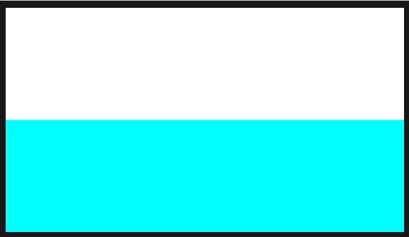

# Creating Your First Scene

First off, if you are new to coding, this will be a hard place to start. Not impossible, but be ready to put in a lot of time before you get something that looks good. If you're new to GLSL, it also has a big learning curve. The hardest part about it is gaining intuitive understanding of the parallel nature of the language. It's unlike any other coding experience. However, the rewards are sweet. If you are daring and excited, try looking at some Fragment Shader examples on [shadertoy](https://www.shadertoy.com/) and [glslsandbox](http://glslsandbox.com/). A great intro to Fragment Shaders is [given here](https://thebookofshaders.com/00/). It may also be helpful to acquaint yourself with the [GLSL types.](https://www.opengl.org/wiki/Data_Type_(GLSL)#Scalars)


**Now, to start, open up Synesthesia, go to the Scene Library and click "create new scene."**

### Hello World
Next, click the pencil icon on the "New Scene" card to edit the scene. You can download this example scene [here](../src/hello_world.zip).

Edit the `main.glsl` file and paste the following code into it:

```glsl

/**
 * Main Rendering Function
 * The vec4 return from this will be the pixel color for the current pass.
 */
vec4 renderMain() {
  return vec4(1, 0, 0, 1); //Return the color red
}

```
 
Edit the `scene.json` file and paste the following code into it:

```json
{
  "TITLE": "Hello World",
  "CREDIT": "Your Name"
}

```
To load the changes to this file, press `cmd/ctrl R`. Whatever scene you were running is now replaced with this one, and you should see a red screen in the visualizer. This is now your live coding environment. You can write code in these files with your favorite text editor, save, and then focus Synesthesia and refresh the scene. If your dev window turns black on refresh, or your changes don't seem to be taking effect, check the output in the developer console. Errors will show up there, and once fixed, just hit 'cmd/ctrl r' to refresh the scene.

The `renderMain()` is comparable to the `void main()` function of a traditional fragment shader.
Instead of specifying a `out fragColor`, you simply return a vec4 of the color you want the pixels to be.

 [](../src/images/HelloWorld.png)


## Available Uniforms and Variables
You don't define any Uniforms in the GLSL yourself when writing a scene. However, there are a lot of uniforms, variables and functions automatically compiled into your shader by Synesthesia. Learning and using these will save you a LOT of time. The most important automatic uniform is `vec2 _uv`, which returns the *normalized pixel coordinates*.

Try the following GLSL to see this.

```glsl
vec4 renderMain() {
  return vec4(_uv.x, _uv.y, 0, 1);
}
```
And you should see a red gradient in the X axis and a green gradient in the Y axis.

Checkout out all the available [standard uniforms and variables](../ssf/standard_uniforms.md) and [audio reactive uniforms](../ssf/audio_uniforms.md).
See the [convenience functions](../ssf/functions.md) available in every shader here.

## Making the visual audio reactive
To add in audio reactivity there are a special set of uniforms that respond to the audio input included in every scene.

All the audio components are prefixed with a `syn_`. `syn_Level` is simply a smoothed volume level. Run the following code, and clap into your microphone to see the screen flash red.


```glsl
vec4 renderMain() {
  return vec4(syn_Level, 0, 0, 1);
}
```

**Typical AudioComponents range between 0 and 1 See [all audio components](../ssf/audio_uniforms.md) here.**

## Making the scene more complex
Let's make this a better scene, by adding in some shapes and action. First, lets split the screen into two colors by defining a function "splitScreen".

Copy/paste the following code into your GLSL file (or just follow along in the hello_world_complete file). Put it BEFORE the renderMain() function, since renderMain should always be the last function in your file.

```glsl
vec3 splitScreen(vec3 screen1, vec3 screen2, float split_value){
	if (_uv.y > split_value){
		return screen1;
	} else {
		return screen2;
	}
}
```

Here, we define a function "splitScreen", that we'll use later in renderMain. The function splits the screen between two "screens" (colors) you pass in. Based on the split_value, it chooses which of the two color arguments should be displayed. Now, in our renderMain() function, lets use this:

```glsl
vec4 renderMain(void)
{
	//Define a color for half of the background. This is white, since RGB are all 1.0
	vec3 whiteBackground = vec3(1.0,1.0,1.0);
	//And here we have the color cyan. No red, full green, full blue.
	vec3 cyanBackground = vec3(0.0,1.0,1.0);
	//Now lets define the *actual* background color, which is a mix between the two.
	vec3 background = splitScreen(whiteBackground, cyanBackground, 0.5);
	
	return vec4(background, 1.0);
}
```

Great, now your output should look like this.

	
	
Now let's add the ability to pan this split up and down with a **Control**.

##Adding Controls

Controls are the buttons, switches, sliders, knobs, XY pads, and color pickers you can add to scenes. They're defined in the JSON, and automatically create uniforms that are passed into the GLSL. Lets change add a new variable called split_position, that is attached to a Slider.

```json
{
 "TITLE": "Hello World",
 "CREDIT": "Your Name",
 "IMAGE_PATH": "thumbnail.png",
  "CONTROLS": [
        {
            "NAME": "split_position",
            "MIN" : 0.0,
            "MAX" : 1.0,
            "DEFAULT":0.5,
            "TYPE":"slider"
        }
    ]
}
```


Now after refreshing the scene you should see a slider appear in the **scene controls** section of the window. Let's map this to the split\_value variable in our splitScreen function, as follows: ```vec3 background = splitScreen(whiteBackground, cyanBackground, split_position);```

Move the slider, and you should see the split move in the scene.

##More Complex Controls
Let's add another controllable object to the scene with a function "drawCircle". This function (seen below) will draw a circle of "circleSize" centered at "circlePosition". It returns only a float, signifying whether we're inside the circle or outside. It uses the coordinate space \_uvc, rather than \_uv, which has (0,0) at the center of the screen, and (0.888, 0.5) in the upper right, (-0.888, 0.5) in the bottom left.

```glsl
float drawCircle(vec2 circlePosition, float circleSize){
	if (distance(_uvc, circlePosition)<circleSize){
		return 1.0;
	}
	return 0.0;
}
```
Then, in our renderMain, let's use it. Define a variable called insideCircle that will be 1.0 inside the circle, but 0.0 everywhere else. For now, fill in the arguments to drawCircle as follows:
```float insideCircle = drawCircle(vec2(0.0, 0.0), 0.3);```

Now we have to use insideCircle to affect the background color. Let's make a new variable called finalColor. And first, let's "cut out" the circle from the background color, so we have the background with a hole in it.
```	vec3 finalColor = background*(1.0-insideCircle);```

Now, lets fill that hole with a new color, a shade of orange: red and green set high, blue low. Then we'll add this color to finalColor, but multiply it by insideCircle, so it is the proper color within the circle, but 0 everywhere else.

```glsl
vec3 circleColor = vec3(1.0,0.75,0.1);
finalColor += circleColor*insideCircle;
```

Finally, we'll now be returning ```vec4(finalColor, 0.0);``` instead of returning ```background```. Your renderMain function should look like this:

```glsl
vec4 renderMain(void)
{
	vec3 whiteBackground = vec3(1.0,1.0,1.0);
	vec3 cyanBackground = vec3(0.0,1.0,1.0);
	vec3 background = splitScreen(whiteBackground, cyanBackground, split_position);

	float insideCircle = drawCircle(vec2(0.0), 0.3);
	vec3 finalColor = background*(1.0-insideCircle);

	vec3 circleColor = vec3(1.0,0.75,0.1);
	finalColor += circleColor*insideCircle;
	
	return vec4(finalColor, 0.0);
}
```

Now, lets map the two arguments of drawCircle to user controlled variables. We'll add two new controls to our JSON list, the first of which will be a ```vec2``` called ```circle_position```.

```json
{
	"NAME": "circle_position",
	"MIN" : -0.5,
	"MAX" : 0.5,
	"DEFAULT":0.0,
	"TYPE": "xy"
}
```
Here by saying ```"TYPE": "xy"```, we're telling the program extra information about this control. We don't just want a slider, we want an XY pad, and our uniform in the GLSL should be a vec2(x,y). We set the MIN to -0.5, and the MAX to 0.5, so the circle can move over the most of the screen. Now, put circle\_position into our drawCircle function: ```drawCircle(circle_position, 0.3);```

You should be able to move the circle around the screen. Next lets add a variable called ```grow_circle``` that is mapped to a momentary button, so every time you hit it, it grows the circle. In our program, these are called "bangs".
```json
{
    "NAME": "grow_circle",
    "MIN" : 0.0,
    "MAX" : 1.0,
    "DEFAULT":0.0,
    "TYPE":"bang"
}
```

 Add grow\_circle to the drawCircle function as follows 
```drawCircle(circle_position, 0.2+grow_circle);```

This is great, however, you'll notice the effect only happens for one frame every time you click on it. That's because a button of type bang only operates for one frame before being switched back to off. However, by using ```bang smooth``` we can trigger it to hop up to 1.0 but then exponentially decay back to 0.0 instead of instantly falling. To do that, we use the following code:


```json
{
    "NAME": "grow_circle",
    "MIN" : 0.0,
    "MAX" : 1.0,
    "DEFAULT":0.0,
    "TYPE":"bang smooth",
    "PARAMS": 0.2
}
```

Notice we not only changed the TYPE signifier, we added another one called "PARAMS". ```PARAMS``` holds any optional values that certain controls may need. In the case of all "smooth-style" controls, it affects how fast the exponential decay occurs, or how fast it'll return to the bottom. 
For more info on controls, read all the [JSON Options here](../ssf/json.md).


Now you should have three controls and a somewhat interactive shader!

## Transitions
Lets add a transition to the shader, to help keep the visual varied over time. Transitions trigger a uniform to change values every time a transition, or "drop" is detected in the music.

In the JSON, define a list called `HARD_TRANSITIONS`. And within that, let's define a variable called colorTransition, which can take on the value 0.0 or 1.0.

```json
{
"TITLE": "Hello World",
"CREDIT": "Your Name",
"IMAGE_PATH": "thumbnail.png",
"HARD_TRANSITIONS": [
        {
            "UNIFORM": "colorTransition", 
            "VALUES":[0.0,1.0]
        }
    ],
"CONTROLS": ...
}
```
Then, in the fragment shader, lets use this to invert the color palette by changing finalColor once more before it is returned. Now, when colorTransition is 0.0, the scene will be normal colors. When it is 1.0, the scene will switch to the inverted color palette. Every time a "drop" occurs in the music, this will switch. You can manually trigger it with the "Transition" Meta Control button.

```glsl
if (colorTransition>0.5) {
	finalColor = 1.0-finalColor;
}
return vec4(finalColor,0.0);
```

For more info on Transitions, read all the [JSON Options here](../ssf/json.md).

## File Structure
Every file pertaining to a certain scene should sit in a folder. Then, name the folder mySceneName.synScene. The programg will now package them together as one file, to make it easy to send to friends and open.


```
mySceneName.synScene
├── main.glsl
└── scene.json
└── script.js
└── thumbnail.png
└── images
    └── image1.jpg
    └── image2.png
```

## The Console


The console outputs errors and helpful messages as you're working. You'll see GLSL syntax errors, JSON errors, and JavaScript errors. You can also print to the console from your JavaScript file using ```console.log("myOutput");``` 

Just above the console you can also see the FPS of your scene. Ideally, all scenes should run at 60fps at 1080p. However, if your scene is really complex, it is okay to shoot for 720p at 60fps. If you're getting significant fps drops, you may need to simplify your scene. 


